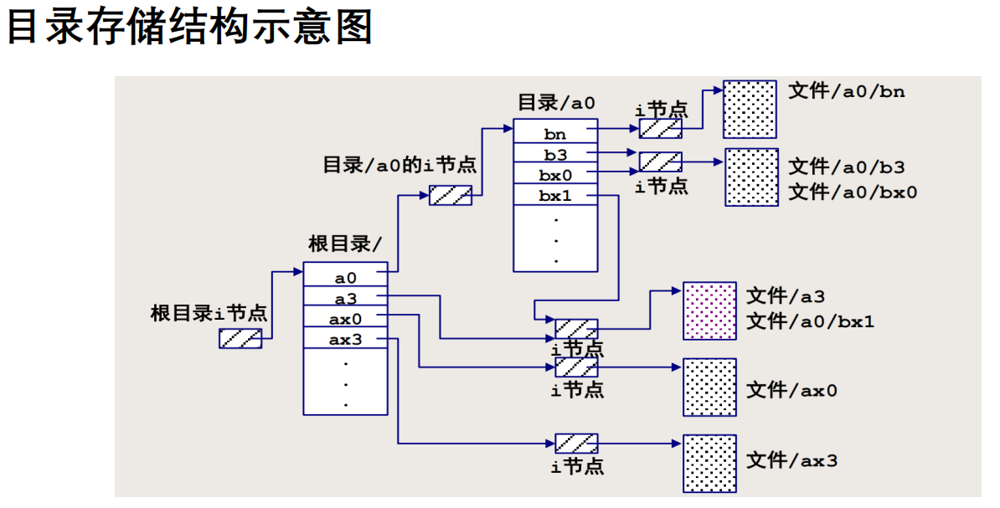
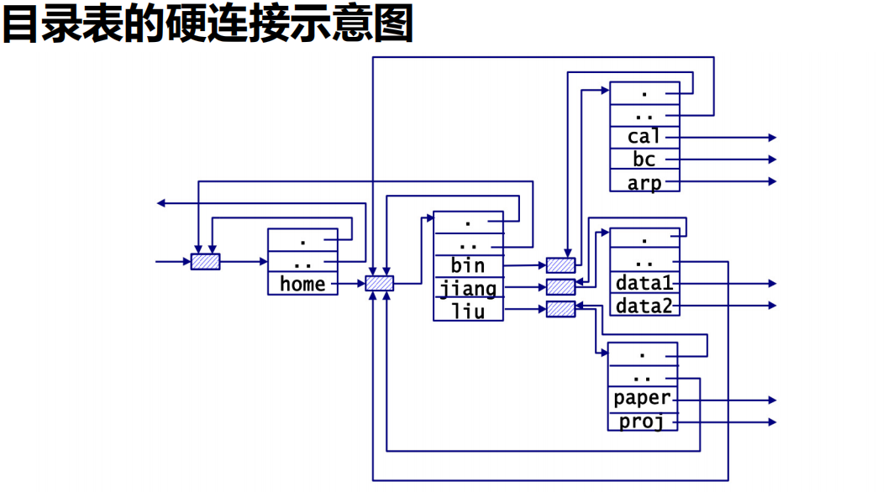
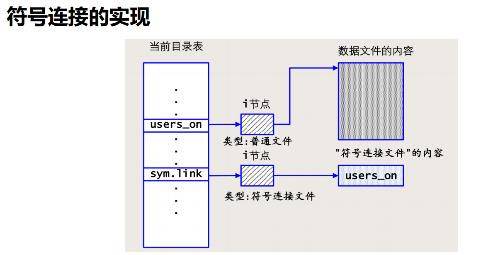

# 第七章 命令风格与目录存储结构
## 命令风格
### Linux系统命令和用户程序(ap)运行时获取信息的方式
配置信息等硬编码是不可取的
- 硬编码需要编程时就确定服务器的地址，程序运行时就无法改变，太不灵活
- 运行时获取信息的常见方式，易变性从小到大为 :
  - 配置文件
  - 环境变量
  - 命令行参数
  - 交互式键盘输入

#### **1、配置文件**
   - **系统级配置**与**用户级配置**：
     - **系统级配置**文件通常存储在系统目录下（如`/etc`），这些文件影响整个系统的行为，所有用户使用相同的配置。例如`/etc/profile`是所有用户登录时读取的Shell环境配置文件。
     - **用户级配置**文件存储在用户的家目录下（如`~/.bash_profile`）。这些文件只影响该用户的配置和环境，而不会对系统中的其他用户产生影响。
   
   - **持久化存储**：配置文件通常用于存储**相对不频繁改变**的信息，比如数据库连接配置、日志级别、文件路径等。因为这些配置不需要频繁更改，存放在配置文件中可以确保即使系统重启或应用重新启动，配置信息仍然保持不变。
   
   - **灵活性**：配置文件为程序提供了**灵活性**。不同的用户可以读取自己的配置文件，使得同一程序可以表现出不同的行为。
     
   - **优势**：持久性高、可以定制不同环境的配置，不同用户可以使用不同配置来调整同一个程序的行为。

#### **2、环境变量**
  **命令`env`**：
     - 在Linux或类Unix系统中，`env`命令可以用来打印出当前用户会话中的所有环境变量。例如：
       ```bash
       env
       ```
       这会显示诸如`PATH`、`HOME`、`USER`、`SHELL`等环境变量。
     
  **设置环境变量**：
     环境变量可以通过命令行或者配置文件设置。设置环境变量可以使其在程序执行期间动态影响程序行为。例如：
     ```bash
     export SERVER="180.249.151.131"
     ```
     这样设置的环境变量只会影响当前会话或当前终端执行的程序。如果要使其永久生效，可以将其写入用户的`~/.bash_profile`或`~/.bashrc`文件中。

  **用途**：环境变量非常适合那些**在程序运行时需要灵活调整的参数**，例如程序路径、临时目录、语言设置等。它们可以动态设置，程序在运行时读取并应用。

  **系统级与用户级环境变量**：
   - 系统级环境变量可以设置在系统的配置文件中（如`/etc/environment`），会影响整个系统所有用户的环境。
   - 用户级环境变量则设置在用户的Shell配置文件中（如`~/.bash_profile`或`~/.bashrc`），仅影响当前用户的Shell会话。

  **示例**：
     - 系统级环境变量：`/etc/environment` 中设置 `JAVA_HOME` 以指示所有用户的Java安装路径。
     - 用户级环境变量：用户可以在`~/.bashrc`中设置自己的环境变量，比如`export PATH="$PATH:/home/user/myapp/bin"`，为自己的程序添加自定义路径。
   
   **优势**：灵活性高，可以在程序运行时动态更改，特别适合在不同环境中快速调整配置，不需要修改代码或配置文件。

   **与环境相关**：环境变量通常存储一些与系统环境或用户环境有关的参数。例如：
    - **`LANG`**：系统的语言设置，决定程序运行时的语言环境。
    - **`HOME`**：当前用户的主目录路径。
    - **`TERM`**：终端类型，影响终端显示和交互行为。
    - **`PATH`**：可执行文件的搜索路径，决定从哪些目录中查找可执行程序。
    - **`CLASSPATH`**：在Java程序中，指定查找Java类文件的位置。
    - **`CVSROOT`**：版本控制系统CVS的根路径，指示CVS操作的默认目录。

   **感知环境差异**：即使运行的程序（可执行文件）是相同的，程序可以通过读取环境变量来“感知”不同的环境设置，从而调整其行为。例如，不同的用户可能会有不同的`HOME`目录，程序读取此环境变量后会在用户自己的目录中执行操作。

   **环境变量的获取与设置**： **C语言中的`getenv()`函数**：C语言提供了`getenv()`函数，用来从环境中获取指定变量的值。


#### 3、交互式键盘输入
这种方式在Linux命令中极少使用，程序启动之后通过计算机与操作员之间的人机交互获取信息，C语言scanf()，fgets()函数

#### 4、命令行参数
程序启动之前指定：通过命令行参数，操作员输入命令时提供处理选项和操作对象

##### 命令行参数的三种风格


## 文件系统的创建与安装
#### 根文件系统与子文件系统
**1、 根文件系统（root filesystem）**

**定义**：根文件系统是整个操作系统的文件系统树的基础，是Linux启动后挂载的第一个文件系统，通常通过`/`符号来表示。

**特性**：
  - **不能卸载**：根文件系统是系统的基础，所有的文件操作和目录访问都基于它，因此它不能被“卸载”（`umount`）。
  - **关键性**：它包含了系统启动时需要的所有核心文件，包括内核、基本命令和库文件等。
  - **存储内容**：根文件系统通常存储基本的操作系统目录结构，如`/bin`, `/lib`, `/etc`, `/dev`, `/sbin`等。

**作用**：系统启动时，内核会加载根文件系统中的内容来启动系统，并且该文件系统必须始终保持挂载状态。它是所有文件和目录的起点。

**2、子文件系统（sub-filesystem）**

**定义**：子文件系统是指除了根文件系统之外，其他可以挂载在根文件系统某个子目录上的独立文件系统。它们可以来自不同的设备或存储介质。

**典型的子文件系统**：
  - 硬盘分区
  - 软盘
  - CD-ROM
  - USB盘
  - 网络文件系统（NFS）
  
**与根文件系统的关系**：
  - 子文件系统必须挂载到根文件系统的某个目录上，才能与系统交互。它们以根文件系统中某一子目录的形式出现，而不像Windows系统那样将每个逻辑盘分为不同的盘符（如C:、D:）。
  - 一旦挂载，子文件系统的内容就完全替代了挂载点原有的内容，所有对该目录的访问实际上都是对子文件系统的访问。

**3、 独立的存储结构**
    
**文件系统的独立性**：每个子文件系统在挂载前都是一个独立的存储单元，它拥有自己的文件系统结构和文件组织方式。即使被挂载到根文件系统，它们的独立性并不会受到影响。


#### `mkfs` 和 `mount`：文件系统的创建与挂载
**1、 创建文件系统：`mkfs`**
`mkfs`（Make FileSystem）命令用于在块设备上创建一个新的文件系统，类似于“格式化”磁盘的操作。

```bash
mkfs /dev/sdb
```
- **/dev/sdb**：这是要创建文件系统的块设备。这个块设备可以是硬盘、分区、USB设备等。
- 默认情况下，`mkfs`会根据系统配置使用最常见的文件系统格式（通常是`ext4`）。

**更多格式化选项：**
- 您可以指定文件系统类型，例如创建`ext4`文件系统：
  ```bash
  mkfs.ext4 /dev/sdb
  ```

**2、挂载文件系统：`mount`**
`mount`命令用于将文件系统挂载到根文件系统中的某个目录下，使用户可以通过该目录访问挂载的子文件系统。

```bash
mount /dev/sdb /mnt
```
- **/dev/sdb**：这是您要挂载的设备（在之前已经创建了文件系统）。
- **/mnt**：这是您希望挂载的目标目录。`/mnt`目录必须事先存在且为空，通常用来作为临时挂载点。

**挂载后的效果**：
- 挂载完成后，您可以通过访问`/mnt`目录来查看和操作`/dev/sdb`上的文件系统。
- 对于应用程序来说，它并不关心文件系统是来自根文件系统还是子文件系统，访问`/mnt`与访问根目录中的其他文件和目录没有区别。

**不带参数的`mount`**：
- 如果您运行`mount`命令时不带任何参数，系统会列出所有当前已挂载的文件系统：
  ```bash
  mount
  ```

#### umount：文件系统的卸载
不再需要访问已挂载的设备时，可以使用`umount`命令来卸载它：
```bash
umount /mnt
```
 **/mnt**：这是之前挂载的目录。卸载后，该目录将返回为空，且子文件系统将不再可访问。


#### df: 文件系统空闲空间

`df`命令用于查看磁盘使用情况，方便管理和监控文件系统的磁盘空间。

使用`-h`选项可以让输出结果以更易读的格式展示，方便用户快速理解磁盘的使用状况。

- **Filesystem**：显示设备或文件系统的名称。
- **1K-blocks**：表示总容量，以1K块为单位。
- **Used**：已使用的空间，以1K块为单位。
- **Available**：可用的空间，以1K块为单位。
- **Use%**：已使用空间的百分比。
- **Mounted on**：该文件系统挂载的目录。
- **Size**：显示文件系统的总大小（如20G）。
- **Avail**：显示可用的空间（如6.8G）。


## Linux文件系统存储结构
### 文件系统的结构
在Linux系统中，磁盘的逻辑设备可以被划分为多个块（或扇区），每个块的大小通常是512字节或其他2的幂的字节大小（如1024、2048等）。

**1、块和引导块**
- **块（扇区）**：
  - 磁盘被划分为多个逻辑块，每个块有一个唯一的编号（从0开始）。例如，编号为0、1、2等。
  - 每个块通常包含512字节或其他较大尺寸（如1KB、2KB等）。

- **引导块（0号块）**：
  - 0号块被称为引导块，用于系统的启动过程。它包含了启动引导程序的信息。
  - 在根文件系统的情况下，只有引导块是有效的。

**2、专用块（1号块）**
  - 也称为管理块或超级块（superblock），它用于存储文件系统的管理信息。
  - 主要包含以下信息：
    - **文件系统的大小**：整个文件系统的总容量。
    - **i节点区的大小**：i节点（inode）区域的大小，i节点用于存储文件的元数据（如权限、所有者、时间戳等）。
    - **空闲空间大小**：文件系统中未使用的空间的总大小。
    - **空闲块链表的头**：用于管理空闲块的链表，以便在写入新数据时能够快速找到可用块。

**3、`mkfs` 和 `df` 命令**
- **`mkfs` 命令**：
  - `mkfs`（Make FileSystem）命令用于在设备上创建文件系统。在创建文件系统时，会初始化引导块和专用块，设置必要的管理信息。

- **`df` 命令**：
  - `df`（Disk Free）命令用于显示文件系统的磁盘使用情况。它读取文件系统的管理信息，包括专用块中的信息，显示已用和可用的空间。

- **`df -i` 命令**：
  - `df -i`命令用于显示i节点的使用情况。它提供每个文件系统的i节点总数、已用i节点和可用i节点的信息，这些信息也来源于专用块中的管理信息。


### i节点区和文件存储区
**1、i节点区（inode area）**
**定义**：
  - i节点（index node，简记为inode）是文件系统中用于存储**文件元数据**的数据结构。i节点区由若干块构成，在使用`mkfs`命令创建文件系统时确定其大小。

**i节点的特征**：
  - 每块可以容纳多个i节点，每个i节点的大小是固定的（通常是64字节）。
  - i节点从0开始编号，系统可以通过这些编号快速索引到磁盘上的块。

**i节点内容**：
  每个文件对应一个i节点，i节点中包含的信息包括：
  - **指向文件存储区数据块的索引指针**：这些指针用于映射文件的逻辑块与硬盘的物理块，使得系统能够定位文件的数据。
  - **文件类型**：指示文件是普通文件、目录、符号链接等。
  - **属主**：文件的拥有者用户ID（UID）。
  - **组**：文件所属的组ID（GID）。
  - **权限**：文件的访问权限（如读、写、执行）。
  - **链接数**：指向该文件的硬链接数量。
  - **大小**：文件的字节大小。
  - **时间戳**：包括创建时间、修改时间和访问时间。

**i节点内不含文件名**：
  i节点仅存储文件的元数据，不包括文件名。文件名与i节点之间的关联存储在目录表中，目录表映射文件名到相应的i节点。

**2、文件存储区（data area）**
**定义**：
  文件存储区是文件系统中用于存放实际文件数据的区域，包括目录表。它包含了文件的内容和其他相关信息。

**文件存储区的特征**：
  - 文件数据存储在一个或多个数据块中，数据块的大小通常与块设备的块大小相同（如512字节、1KB等）。
  - 当文件被创建时，其数据会被写入文件存储区，i节点会记录这些数据块的位置。
  - 目录表是文件存储区的一个重要组成部分，存储了文件名到i节点的映射关系。

### 目录的存储结构
**1、Linux目录结构**
- **树形结构**
- **带交叉勾连**
  - 目录之间可以有交叉链接，例如使用符号链接（symlink）可以让不同的目录指向同一个文件，从而实现文件的共享和重复使用。

**2、目录表**
- **定义**：
  - 每个目录在文件系统中都有一个对应的目录表，目录表本身被视为一个文件，存储在文件存储区中，并有其独立的i节点和数据存储块。

- **目录表的组成**：
  - 目录表由若干个“目录项”（directory entries）构成。每个目录项包含两部分信息：
    1. **文件名**：指示文件或子目录的名称。
    2. **i节点号**：指向文件或子目录的i节点，允许系统访问其元数据和实际数据。


**3、目录表与i节点**
- **i节点**：
  - 每个目录和文件都有一个对应的i节点，i节点中存储了文件或目录的元数据（如权限、拥有者、链接数、文件大小、时间戳等）和指向实际数据块的指针。
  - 目录的i节点与普通文件的i节点类似，只是它们的内容指向的是其他文件或目录的i节点，而不是实际的数据。

- **目录大小**：
  - 使用`ls`命令列出的目录大小表示的是该目录表文件本身的长度，而不是其中包含的文件和子目录的总大小。


### 目录存储结构示意图



### 目录表和i节点两级结构
```
假设环境中：
- 文件名使用定长14字节。
- 索引信息需要64字节。
- 每个磁盘块的大小为512字节。
- 当前目录下有100个文件，其中要访问的文件名是`mydata.bin`，并且它位于目录表的最末尾。
```
**1、方案一：一级结构**
- **结构**：
  - 在该方案中，文件名和索引信息都存放在同一个目录表中。
  - 每个目录项的大小为：`14字节（文件名） + 64字节（索引信息） = 78字节`。
  - 每个磁盘块可以容纳的目录项数量为：`512字节 ÷ 78字节 ≈ 6个目录项`。

- **磁盘操作次数**：
  - 总共需要进行17次磁盘操作。

**2、方案二：两级结构**
- **结构**：
  - 文件名和索引信息分开存储，索引信息存放在i节点中，而目录表中仅记录文件名和i节点的编号。
  - 每个目录项的大小为：`14字节（文件名） + 2字节（i节点编号） = 16字节`。
  - 每个磁盘块可以容纳的目录项数量为：`512字节 ÷ 16字节 = 32个目录项`。

- **检索过程**：
  - 通过该结构，系统可以在4个块内找到`mydata.bin`的i节点号。
  - 一旦得到i节点号，系统可以根据该号访问对应的磁盘块，并读取i节点中的索引信息。

- **磁盘操作次数**：
  - 总共需要进行5次磁盘操作（4次读取目录块 + 1次读取i节点）。

**3、两种方案的比较**
- **访问效率**：
  - 方案二（两级结构）相比方案一（一级结构）显著减少了磁盘访问次数（从17次减少到5次）。
  - 这意味着文件系统在查找文件时更加高效，尤其是在目录项较多时，检索时间大大缩短。

- **存储灵活性**：
  - 在两级结构中，目录项仅存储文件名和对应的i节点号，允许同一i节点号在同一目录或不同目录中对应多个目录项。这种方式支持硬链接和符号链接的实现。

- **文件系统设计的优势**：
  - 采用两级结构的文件系统能够更好地管理文件，提供更高的检索效率和灵活性，尤其在处理大量文件时，性能提升显著。


### 命令stat：读取i节点信息
`stat`命令在Linux系统中用于显示文件或文件系统的详细信息，包括与i节点相关的各类元数据。
**1、基本语法**
```bash
stat [选项] <文件名>
```
执行`stat`命令的基本形式：`stat filename`

**2、常用选项**
- `-c`：使用自定义格式输出。例如：这将输出文件名和文件大小。
  ```bash
  stat -c "%n: %s bytes" filename
  ```
- `-f`：显示文件系统的信息，而不是文件的信息。
- `--help`：显示帮助信息。


## 硬连接
### 硬连接
- 目录表由目录项构成，**目录项**是一个“**文件名-i节点号**”对
- 根据文件系统的存储结构，可以在**同一目录或者不同目录中的两个目录项，有相同的i节点号**
- 每个目录项指定的“文件名-i节点号”映射关系，叫做1个硬连接
- **硬连接数目(link数)：同一i节点被目录项引用的次数**

### ln: 普通文件的硬连接

**1、硬连接的概念**

- **硬连接（Hard Link）**：在文件系统中，一个硬连接是对文件的直接引用。多个文件名可以共享同一个i节点，这意味着它们实际上是同一个文件，内容相同。

- **i节点**：每个文件在文件系统中都有一个唯一的i节点，存储了文件的元数据（如文件大小、权限、数据块位置等）。硬连接通过共享同一个i节点，使得不同文件名可以引用相同的数据。

**2、创建硬连接**
使用`ln`命令可以创建硬连接，基本语法如下：
```bash
ln <源文件> <目标文件>
$ ln chapt0 intro
```
此命令创建了一个名为`intro`的硬连接，指向`chapt0`文件。

**3、查看硬连接的信息**
- 可以使用`ls -l`命令查看文件的详细信息，包括链接数：
`ls -l chapt0 intro`

- 可以使用`ls -i`命令查看文件的i节点号：
`ls -i chapt0 intro`

**4、硬连接的特性**

- **地位平等**：`chapt0`和`intro`是完全平等的；删除其中一个文件并不会影响另一个文件的存在。即使删除`chapt0`，`intro`仍然存在，且文件内容不变。

- **链接计数**：硬连接的链接计数表示指向同一i节点的文件名数量。如果一个硬连接被删除，链接计数减少，直到链接计数为0时，文件内容才会被实际删除。

- **文件系统限制**：硬连接只限于在同一文件系统内创建，因为i节点在不同文件系统间是不可共享的。

**5、删除硬连接**
如果删除`chapt0`：`rm chapt0`
- `intro`仍然存在，但链接计数将减少1。


### 目录表的硬连接
**硬连接的限制**：在Linux系统中，通常不允许对目录使用`ln`命令创建硬连接。这是为了维护文件系统的完整性和防止循环引用的问题。如果允许对目录创建硬连接，可能导致复杂的循环结构，使得文件系统的遍历变得困难。

**特殊链接数**：对于每个目录，其链接数（link count）表示指向该目录的硬连接数量。一般来说，目录的链接数可以用以下公式来计算：

  \[
  \text{link数} = \text{直属子目录数} + 2
  \]

- **`+2`**：这个“2”代表：
   - 一个链接指向自己（`.`），即当前目录的引用。
   - 另一个链接指向父目录（`..`），即上级目录的引用。


### 目录表的硬连接示意图



## 符号连接
**1、符号连接（Soft Link）**：符号连接是指创建一个特殊的文件，该文件中只存储指向另一个文件或目录的路径名。它并不直接指向文件的i节点，而是通过路径引用原始文件。

**2、创建符号连接**
使用`ln -s`命令创建符号连接。
```bash
ln -s <目标文件> <符号链接名>
```

假设为`users_on`文件创建一个名为`sym.link`的符号连接：
```bash
ln -s users_on sym.link
```

**3、查看符号连接的信息**
可以使用`ls -l`命令查看符号连接的详细信息，例如：
```bash
ls -l sym.link
```
输出示例：
`lrwxrwxrwx 1 guest other 8 Jul 26 16:57 sym.link -> users_on`

- **类型**：以`l`开头，表示这是一个符号连接。
- **权限**：显示连接的权限（通常是`lrwxrwxrwx`）。
- **链接数**：符号链接的链接数通常为`1`。
- **大小**：显示为`8`字节，表示存储路径字符串`users_on`的长度。
- **目标**：`-> users_on` 表示符号链接`sym.link`指向文件`users_on`。

**4、符号连接的特性**
- **删除符号连接**：删除符号连接文件不会影响原始文件。
- **原始文件的存在**：如果原始文件被删除，符号连接将失效，访问符号连接将导致“文件未找到”的错误。此时，符号连接称为“悬挂链接”（dangling link）。
- **路径依赖**：符号连接可以跨文件系统创建，因为它只保存路径，而不是直接引用i节点。


### 符号连接的实现



### 符号连接中的相对路径
**1、符号连接中的路径解析**
- **绝对路径名的符号链接**：如果符号链接包含绝对路径，访问该符号链接时，系统将直接访问指定的绝对路径。
- **相对路径名的符号链接**：如果符号链接使用相对路径，路径的解析是相对于符号链接文件的位置，而不是相对于调用进程的当前工作目录。这意味着符号链接的相对路径是固定的，始终相对于链接本身的位置。

假设有以下目录结构：
```
d/
├── d1/
│   ├── dlb
│   └── dx (符号连接)
```
在当前目录`d`下，执行命令：
```bash
ln -s d1/dlb d1/dx
```
- **创建符号链接**：这条命令在`d1`目录中创建一个名为`dx`的符号链接，指向`d1`目录中的`dlb`文件。
- **路径解析示例**：
  在`d`目录下，执行以下命令：`cat d1/dx`等同于`cat d1/dlb`


### 硬连接与符号连接的比较
| 特性                  | 硬连接                        | 符号连接                     |
|---------------------|------------------------------|------------------------------|
| **实现层次**          | 数据结构层次上实现                  | 算法软件层次上实现               |
| **适用对象**          | 仅适用于普通文件                  | 适用于普通文件和目录              |
| **跨文件系统**        | 不支持                          | 支持                          |
| **链接结构**          | 直接指向文件的i节点                | 存储目标路径（绝对或相对路径）        |
| **占用资源**          | 资源占用少                       | 占用操作系统内核的一部分开销        |
| **文件删除影响**      | 删除任何一个硬连接，文件数据仍然存在   | 删除符号连接文件，不影响原文件数据  |
| **循环引用**          | 不存在                          | 可能发生，需要特殊处理            |


#### 循环式符号连接处理
在处理符号连接时，若存在循环引用，可能导致程序或命令行工具在访问文件时陷入无限循环。

1. **解析计数器**：
   - 每次解析符号连接时，增加一个计数器。
   - 设置一个最大阈值，如果解析次数超过该阈值，则停止解析并报告错误。例如，如果计数器超过10次，则认为存在循环连接。

2. **路径缓存**：
   - 维护一个路径缓存，记录当前解析的路径。
   - 如果在解析过程中发现路径已经存在于缓存中，则可以推断出循环并停止解析。

3. **用户警告**：
   - 当检测到循环连接时，向用户提供警告信息，提示可能的循环引用，并建议用户检查符号连接。


## Linux系统调用
### 系统调用(System call)
1、系统调用（System Call）是应用程序与操作系统内核之间进行交互的主要方式，提供了一种标准化的接口，使得程序可以请求操作系统执行各种操作。以下是关于系统调用的一些重要信息和特性：

**2、定义**：系统调用是操作系统提供的一组接口，允许用户级应用程序请求内核执行特权操作，例如文件管理、进程控制和设备管理等。

**3、形式**：系统调用通常以 C 语言函数调用的方式实现。例如，常见的文件操作系统调用包括 `open`、`read`、`write` 和 `close`。

**4、执行方式的区别**
- **系统调用**：
  - **进入内核模式**：系统调用通过软中断（例如 CPU 的 `INT` 指令）进行。当程序需要执行特权操作时，它会产生一个中断，导致 CPU 切换到内核模式,如`getpid()`，这种模式允许操作系统直接访问硬件和系统资源。
  - **开销较大**：因为系统调用涉及上下文切换和内核模式与用户模式之间的转换，其执行开销通常高于普通的函数调用。

- **库函数**：
  - **用户模式执行**：库函数在用户模式下执行，调用时不会切换到内核模式。例如，字符串拷贝函数 `strcpy()` 只是简单地复制内存中的数据，不涉及任何系统资源的管理。
  - **开销较小**：库函数的调用通常比系统调用快，因为它们不需要上下文切换。


**5、库函数对系统调用的封装（API）**
**封装目的**：
  - **提高效率**：库函数可以对系统调用进行优化，减少重复的系统调用，提高效率。
  - **方便调用**：库函数提供了简化的接口，使得开发者可以更方便地使用复杂的系统功能。

**例子**：
  - `printf()` 库函数内部实际上可能调用了 `write()` 系统调用来输出数据。
  - `malloc()` 和 `free()` 库函数通常封装了 `sbrk()` 系统调用，以管理内存分配和释放。

**6、可移植性**
**标准化接口**：系统调用和库函数的名称、参数顺序、参数类型、返回值类型等通常遵循 POSIX 标准规范，这使得不同 Unix 系统之间的程序具有良好的可移植性。
  
**实现功能的相似性**：尽管不同操作系统可能对系统调用的具体实现有所不同，但它们通常提供类似的功能，这使得开发者可以编写在多种系统上运行的代码。


### 系统调用函数的返回值
**1、 返回值**：
  - 成功的返回值通常大于或等于零。
  - 如果系统调用失败，返回值为 `-1`，表示操作未成功。

**2、整型变量 `errno`**
- **`errno` 的作用**：
  - 在标准库中，`errno` 是一个全局整型变量，用于存储最近一次系统调用或库函数调用失败的错误码。当某个系统调用失败时，操作系统将相应的错误代码赋值给 `errno`。

- **常用错误代码**：
  - `EACCES`：权限被拒绝。
  - `EIO`：输入输出错误。
  - `ENOMEM`：内存不足。
  - `EINTR`：系统调用被信号中断。


### 库函数strerror与printf的格式符%m
**strerror:**
- char *strerror(int errno);
- errno是个整数，便于程序识别错误原因，不便于操作员理解失败原因
- 库函数strerror将数字形式的错误代码转换成一个可阅读的字符串

**printf的%m:**
- printf类函数格式字符串中的%m会被替换成上次系统调用失败的错误代码对应的消息（message）


